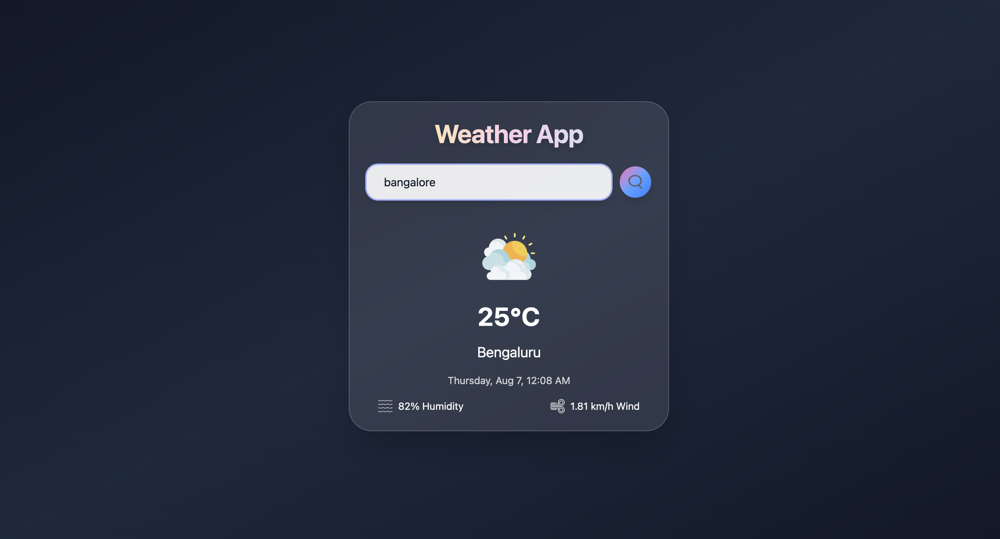

# 🌤️ WeatherApp

A sleek and responsive weather app built with **React**, **Vite**, and **Tailwind CSS**. It fetches real-time weather data and displays temperature, humidity, and weather conditions based on your input.

## 🚀 Live Demo

🌐 [View Live on Vercel](https://weather-app-swart-eight-11.vercel.app/)  


---

## 📸 Screenshots

  

---

## ⚙️ Features

- 🌍 Search weather by city name
- ☁️ Real-time weather conditions
- 🌡️ Temperature, humidity, and wind info
- 📱 Responsive UI for all devices
- ⚡ Fast builds with Vite

---

## 🛠️ Tech Stack

- **Frontend**: React + Vite
- **Styling**: Tailwind CSS
- **API**: OpenWeatherMap API
- **Deployment**: Vercel

---

## 📦 Installation

```bash
# Clone the repo
git clone https://github.com/your-username/WeatherApp.git
cd WeatherApp

# Install dependencies
npm install

# Start the development server
npm run dev
